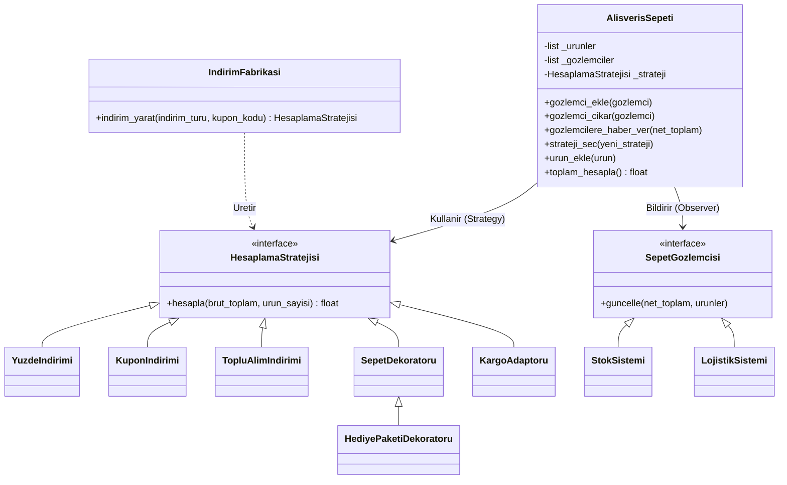

# E-Ticaret Sepeti — Tasarim Oruntuleri Projesi

## Konu Secimi: D (E-Ticaret Sepeti)

E-ticaret sistemlerinde indirim, kampanya ve lojistik kurallari is sureclerine gore surekli olarak degisir. Bu nedenle, indirim kurallarinin tek bir sinifa gomulu oldugu ve `if-elif` zincirleriyle yonetildigi bir mimari, gercek hayatta hizla kontrol edilemez bir teknik borca donusur. Bu konu, tasarim oruntulerinin pratik kazanimini en net gosterecek senaryo oldugu icin secilmistir.

---

## Projenin Amaci

Bu projenin temel amaci; baslangicta tek bir sinif icerisine sikismis olan, SOLID prensiplerine aykiri ve genisletilmesi imkansiz olan bir e-ticaret sepet hesaplama motorunu, endustriyel standartlara uygun kurumsal bir mimariye donusturmektir.

Sistem, sepete eklenen urunlerin brut tutarlarini hesaplar. Ardindan, runtime (calisma aninda) secilen Strategy oruntusune gore indirimleri (Kupon, Yuzde veya Toplu Alim) uygular. Eger yapiya ek operasyonel maliyetler (hediye paketi, harici kargo entegrasyonu vb.) dahil edilirse, Decorator ve Adapter yapilari devreye girerek bu fiyatlari dinamik olarak sepet tutarina yansitir. Hesaplama bittigi an Observer yapisi sayesinde eldeki nihai veri, Stok ve Lojistik gibi harici alt sistemlere gevsek bagli (loose coupling) bir sekilde raporlanir.

---

## Faz 0 — Baslangic Kodu

Refactor edilmemis ilk hal `src/_legacy/sepet_v0.py` dosyasinda referans olarak saklanmaktadir. Bu kod kasitli olarak God Class, if-elif zincirleri, magic numbers ve gizli bir bug icermektedir. Tespit edilen sorunlarin detayli analizi `PROBLEMS.md` dosyasindadir.

---

## Mimari Diyagram



---

## Kullanilan Tasarim Oruntuleri

### Creational (Yaratimsal)

| Oruntu | Nerede | Ne Kazandirdi |
|---|---|---|
| **Factory Method** | `IndirimFabrikasi.indirim_yarat()` | Indirim nesnelerinin yaratim surecini soyutlayarak sepet sinifini somut indirim sinifindan bagimsizlastirdi. |

### Structural (Yapisal)

| Oruntu | Nerede | Ne Kazandirdi |
|---|---|---|
| **Decorator** | `SepetDekoratoru`, `HediyePaketiDekoratoru` | Hediye paketi gibi ek finansal/operasyonel ozellikleri, mevcut indirim yapilarini bozmadan dinamik olarak sarmalamayi sagladi. |
| **Adapter** | `KargoAdaptoru` | Sisteme tamamen yabanci olan harici kargo hesaplama API entegrasyonunun sisteme uyum saglamasini mumkun kildi. |

### Behavioral (Davranissal)

| Oruntu | Nerede | Ne Kazandirdi |
|---|---|---|
| **Strategy** | `HesaplamaStratejisi`, `AlisverisSepeti.strateji_sec()` | Hesaplama ve indirim algoritmalarinin runtime'da dinamik olarak degistirilebilir ve secilebilir olmasini sagladi. |
| **Observer** | `SepetGozlemcisi`, `StokSistemi`, `LojistikSistemi` | Sepet guncellendiginde yan sistemlerin (Stok ve Lojistik) gevsek bagli (loose coupling) bir sekilde haberdar edilmesini sagladi. |

Tum oruntulerin detayli aciklamasi `PATTERNS.md` dosyasindadir.

---

## Proje Yapisi

```
.
├── README.md                  Mimari diyagram + kullanim
├── PATTERNS.md                Her oruntunun belgelenmesi
├── PROBLEMS.md                Baslangic kodunun analizi (Faz 0)
├── src/
│   ├── sepet.py               Refactor edilmis ana kod
│   └── _legacy/
│       └── sepet_v0.py        Faz 0 baslangic kodu (referans)
├── docs/
│   ├── diagrams/              UML diyagramlari (mermaid + svg)
│   └── ai-log/
│       ├── phase1.md
│       ├── phase2.md
│       └── phase3.md
└── .github/workflows/ci.yaml  GitHub Actions
```

---

## Nasil Calistirilir?

Projenin herhangi bir ucuncu parti kutuphane bagimliligi yoktur. Sadece yerel Python ortaminin (3.10+) kurulu olmasi yeterlidir.

```bash
python src/sepet.py
```

### Beklenen Cikti

```
--- DURUM 1: Yuzde Indirimi Stratejisi (Fabrika ile) ---
[STOK SISTEMI] Sepetteki 3 adet urun icin stok bloke islemleri tetiklendi.
[LOJISTIK SISTEMI] 720.0 TL tutarindaki sepet icin sevkiyat ve paketleme hazirliklari basladi.
Net Tutar: 720.0 TL

--- DURUM 2: Toplu Alim Indirimi (Fabrika ile) ---
[STOK SISTEMI] Sepetteki 3 adet urun icin stok bloke islemleri tetiklendi.
[LOJISTIK SISTEMI] 770.0 TL tutarindaki sepet icin sevkiyat ve paketleme hazirliklari basladi.
Net Tutar: 770.0 TL

--- DURUM 3: Kupon Indirimi + Hediye Paketi (Decorator) ---
[STOK SISTEMI] Sepetteki 3 adet urun icin stok bloke islemleri tetiklendi.
[LOJISTIK SISTEMI] 415.0 TL tutarindaki sepet icin sevkiyat ve paketleme hazirliklari basladi.
Net Tutar: 415.0 TL

--- DURUM 4: Harici Kargo Servisi (Adapter) ---
[STOK SISTEMI] Sepetteki 3 adet urun icin stok bloke islemleri tetiklendi.
[LOJISTIK SISTEMI] 825.0 TL tutarindaki sepet icin sevkiyat ve paketleme hazirliklari basladi.
Net Tutar: 825.0 TL
```

---

## Branch Yapisi

| Branch | Icerik |
|---|---|
| `main` | Temiz, merge edilmis son durum |
| `phase-1` | Creational calismasi (Factory Method) |
| `phase-2` | Structural calismasi (Decorator + Adapter) |
| `phase-3` | Behavioral calismasi (Strategy + Observer) |

---

## CI/CD

Her push ve pull request'te GitHub Actions uzerinden iki adim calisir:

1. **Syntax kontrolu**: `python -m py_compile`
2. **Smoke test**: `python src/sepet.py` calistirilir ve hatasiz biten bir cikti uretmesi kontrol edilir.

Calisma durumu: `.github/workflows/ci.yaml`